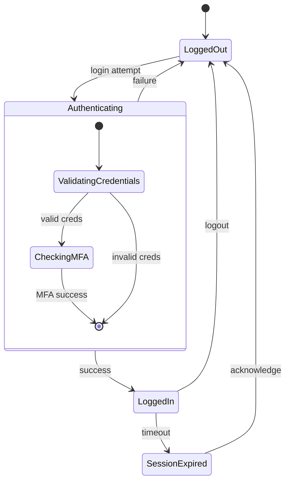
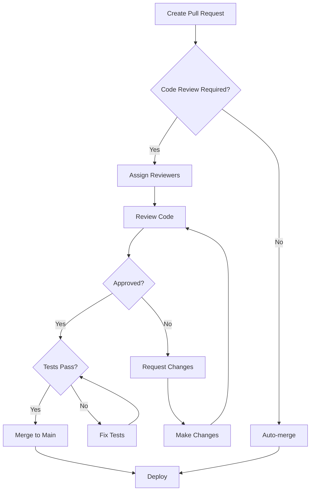
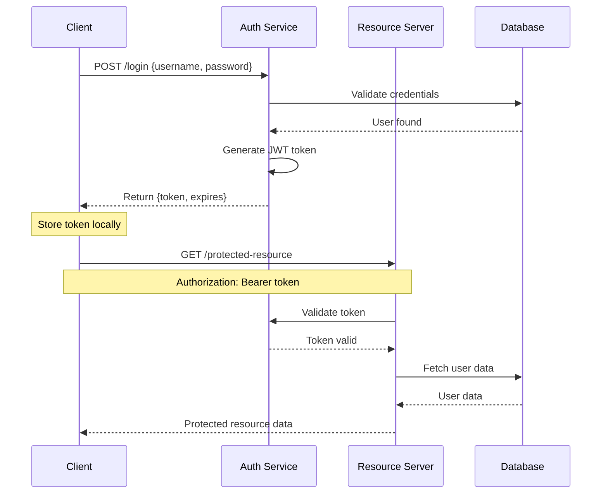
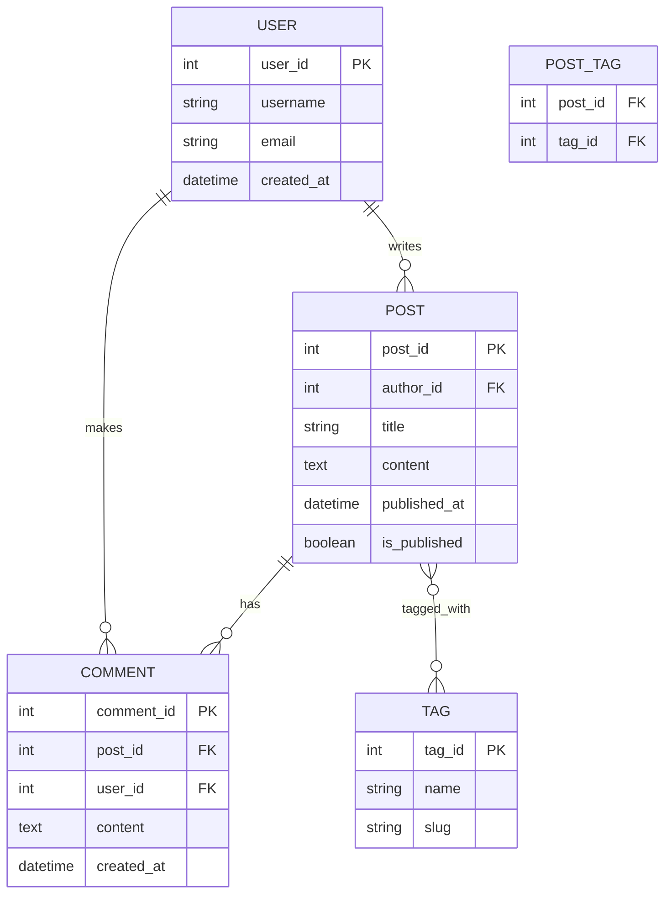
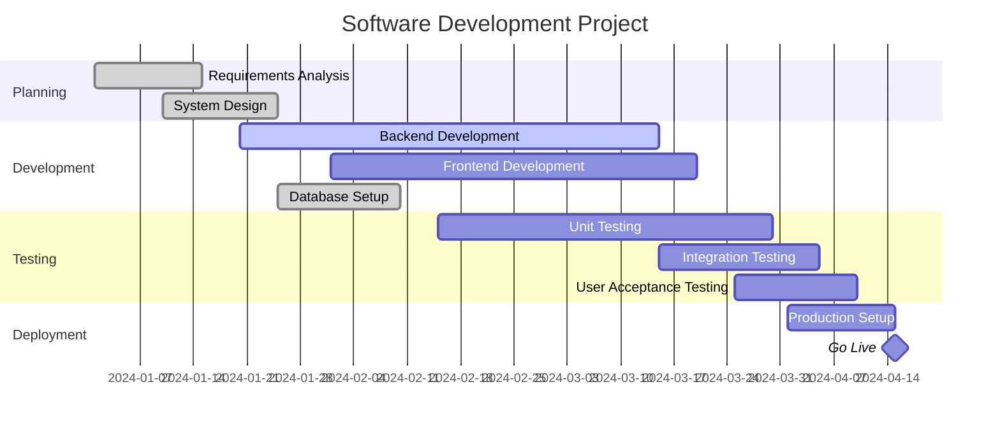
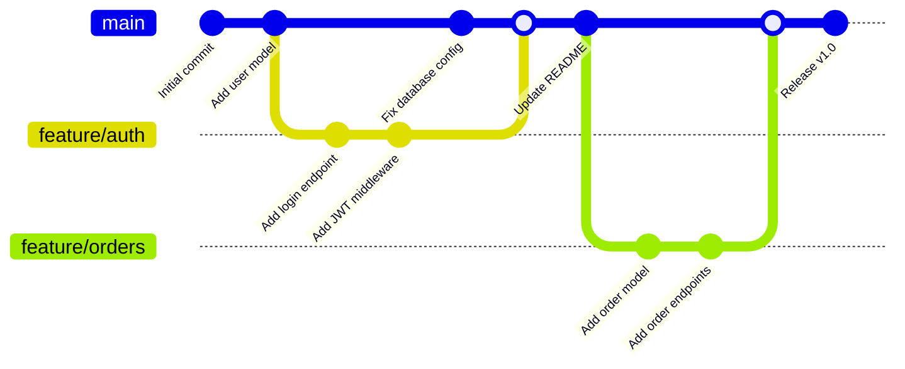
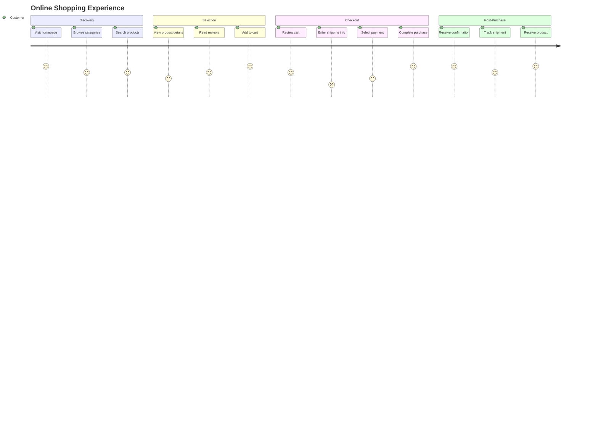

# Mermaid Diagram Examples

## State Diagram - User Authentication


## Class Diagram - E-commerce System
```mermaid
classDiagram
    class User {
        +String email
        +String password
        +login()
        +logout()
        +updateProfile()
    }

    class Order {
        +String orderId
        +Date orderDate
        +OrderStatus status
        +calculateTotal()
        +addItem()
        +removeItem()
    }

    class Product {
        +String productId
        +String name
        +Float price
        +Integer stock
        +updateStock()
        +getDetails()
    }

    class OrderItem {
        +Integer quantity
        +Float unitPrice
        +getSubtotal()
    }

    User ||--o{ Order : places
    Order ||--o{ OrderItem : contains
    Product ||--o{ OrderItem : references
```

## Flowchart - Code Review Process


## Sequence Diagram - API Authentication


## Entity Relationship Diagram - Blog System


## Gantt Chart - Project Timeline


## Git Graph - Feature Branch Flow


## User Journey - Online Shopping
